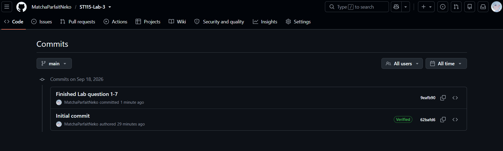

## Question-1

"Already up to date."

`git pull` retrieves and integrates new commits from the remote repository. Local file changes alone do not make the remote branch “newer,” so `git pull` can still report “Already up to date.”

## Question-2 & 3

We run `install.packages()` in the Console because we usually only need to install a package once on a computer or R environment. After the package is installed, we use `library()` to load the package into the current R session so we can use its functions. This is also why we put `library()` in a `.qmd` file: the package needs to be loaded each time the document is rendered.

## Question-4

```{r}
palmerpenguins::penguins
```

We don't have the package `palmerpenguin` installed in our environment.

## Question-5

The first friend is correct. The original code used `palmerpenguins::`, which already tells R which package to use, so `library(palmerpenguins)`is unnecessary.

## Question-6

```{r, message=FALSE}
# Use message=FALSE to hide the warning message
library(dplyr)
```

## Question-7

```{r}
iris2 <- arrange(iris, Petal.Length)
head(iris2)
```

## Question-8



